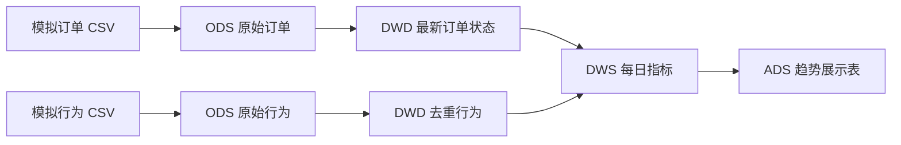

# 电商订单离线数仓与每日经营指标（Apache Hive）

一个用于求职展示的个人练习项目：用 **7 天可复现的模拟订单与用户行为数据**，编写 ODS → DWD → DWS → ADS 的 HiveQL 流水线，并核对 DAU、付费用户、订单数、GMV、付费转化率和三日滚动 GMV。

> **验证状态（2026-10-04）**：已运行 `scripts/validate_local.py`，用 SQLite 执行仓库中 Hive SQL 的 `SELECT` 部分，并与独立生成的预期指标核对通过。当前机器没有 Docker/Hive；`CREATE TABLE`、`LOAD DATA`、`INSERT OVERWRITE` 和实际分区行为**尚未在 Hive 中端到端运行**。仓库提供 GitHub Actions 流程，上传后可在 GitHub 的运行环境完成这一步。因此本项目暂不宣称 Hive 实测通过、上线或性能提升。

## 项目结构

```text
data/                       无表头原始 CSV、预期结果、数据清单
sql/01_create_tables.sql    ODS/DWD/DWS/ADS 建表
sql/02_load_raw.sql         将 CSV 加载到 ODS
sql/03_build_dwd.sql        最新状态去重、清洗、动态分区写入
sql/04_build_dws.sql        日指标与付费转化率
sql/05_build_ads.sql        三日滚动 GMV、GMV 日环比
sql/06_quality_checks.sql  唯一性、金额、指标对账检查
sql/07_assert_quality.sql  Hive 端异常断言，失败时终止流水线
sql/08_explain.sql         可选：查看按 dt 查询的执行计划
scripts/                    数据生成、本地验证和 Docker 运行脚本
docs/                       设计说明与可复制的简历文字
compose.yaml                官方 Apache Hive 4.0.0 镜像的本地演示配置
.github/workflows/          GitHub Actions 的 Hive 端到端检查
```



## 业务口径

| 指标 | 定义 |
|---|---|
| DAU | 当天有有效行为的去重用户数 |
| 付费用户 | 当天有有效行为，且有最新状态为 `paid` 的当日订单的去重用户数 |
| 支付订单数 | 按下单日期统计，最新状态为 `paid` 的订单数 |
| GMV | 上述支付订单的金额之和，金额单位为虚构的“元” |
| 付费转化率 | 付费用户 / DAU |
| 三日滚动 GMV | 当天及前两条日记录的 GMV 之和；样例日期连续 |
| GMV 日环比 | `(当天 GMV - 前一天 GMV) / 前一天 GMV` |

订单如果晚些时候被取消或退款，重新处理原下单日期后就不再计入当日 GMV。`order_time` 使用统一的 `YYYY-MM-DD HH:MM:SS` 文本格式；本演示按日期字符串排序，不处理跨时区问题。更多取舍见 [设计说明](docs/design.md)。

## 数据与示例结果

数据是脚本用固定种子生成的，**不包含真实用户信息**。本次生成得到 935 行原始订单记录、2,824 行原始行为记录，覆盖 2026-09-24 至 2026-09-30；有重复上报、状态更新、零金额和非法用户编号。明细见 [`data/manifest.json`](data/manifest.json)。

例如，预期的 2026-09-30 日指标为：DAU **149**、付费用户 **58**、支付订单 **68**、GMV **18,666.17**、付费转化率 **0.3893**。完整预期结果在 [`data/expected_daily_metrics.csv`](data/expected_daily_metrics.csv)。

## 不安装 Hive 时先验证业务逻辑

以下命令均在项目根目录 `hive-ecommerce-warehouse/` 执行。

需要 Python 3.10 或更新版本；没有第三方 Python 依赖。

```bash
python scripts/generate_data.py
python scripts/validate_local.py
```

第二条命令会从 `sql/03` 至 `sql/05` 中提取**实际编写的 `SELECT` 语句**，在 SQLite 中建立同名表并执行，再与 `data/expected_*.csv` 比较，同时执行 `sql/06` 的五条异常检查。它验证指标计算逻辑，不替代 Hive 运行。

## 有 Docker 后运行 Hive

项目使用 [Apache Hive 官方 Docker 指南](https://hive.apache.org/docs/latest/admin/setting-up-hive-with-docker/)中的 `apache/hive:4.0.0` 单容器 HiveServer2 方案。需要 Docker Desktop 或 Docker Engine + Compose。下载镜像及首次启动可能较慢。

Windows PowerShell：

```powershell
./scripts/run_all.ps1
```

如果本机 PowerShell 的脚本执行策略阻止运行，可只对这次进程使用 `powershell -ExecutionPolicy Bypass -File .\scripts\run_all.ps1`。

Linux/macOS：

```bash
bash scripts/run_all.sh
```

脚本启动容器，等待 HiveServer2 就绪，然后依次执行 `sql/01` 到 `sql/07`。`sql/07_assert_quality.sql` 使用 Hive 的 `assert_true`，发现异常会让脚本失败。原始 CSV 被只读挂载到容器内 `/project/data`；`LOAD DATA LOCAL` 读取的是 **HiveServer2 容器内路径**。[Hive LOAD DATA 文档](https://hive.apache.org/docs/latest/language/languagemanual-dml/) · [assert_true 文档](https://hive.apache.org/docs/latest/language/languagemanual-udf/)

脚本最后还执行 `data/expected_hive_assertions.sql`，将 Hive 实际算出的 DWS/ADS 每日结果与固定种子生成的预期值逐日比较。这个断言文件由 `scripts/generate_data.py` 生成。

执行后可以再查：

```bash
docker compose exec -T hive beeline -u 'jdbc:hive2://localhost:10000/' -e 'USE hive_portfolio; SHOW PARTITIONS dws_daily_metrics; SELECT * FROM ads_daily_dashboard ORDER BY dt;'
```

把结果与 `data/expected_dashboard.csv` 比较。这个单容器 Derby 配置只用于学习；删除容器后元数据和表数据不保证保留。运行脚本会覆盖本项目数据表中的现有内容，不要接到真实业务库。

想练习看执行计划，可单独运行 `sql/08_explain.sql`，观察查询 `dt='2026-09-30'` 时的扫描范围：

```bash
docker compose exec -T hive beeline -u 'jdbc:hive2://localhost:10000/' -f /project/sql/08_explain.sql
```

## 没有本地 Docker 时：用 GitHub Actions 验证

将 `.github/workflows/hive-e2e.yml` 一并上传到仓库。进入 GitHub 仓库的 **Actions → Hive end-to-end check → Run workflow**。绿色通过后再把 README 顶部的状态改成“已在 GitHub Actions 的 Hive 4.0.0 容器完成端到端验证”，并保留该次运行链接。工作流会执行数据生成、本地逻辑校验、Hive 读写、数据质量断言及逐日指标对照。若运行失败，先查看失败步骤和 Hive 日志，不要把未通过的流程写成已验证。

## 求职时怎么讲

1. 为什么 DWD 要先按 `order_id` 取最新版本，再做质量过滤？如果先过滤，坏的最新记录可能让旧状态重新出现。
2. 为什么 DWD/DWS 按 `dt` 分区，写入时用 `INSERT OVERWRITE ... PARTITION (dt)`？如何限定一次重算涉及的日期？
3. 为什么付费转化率要把“当天活跃用户”和“当天付费用户”按用户与日期关联？
4. 次日收到退款记录，原下单日的 GMV 如何回刷？
5. 本地 SQLite 验证覆盖了什么，尚未覆盖什么？

可复制的简历描述在 [`docs/resume-copy.md`](docs/resume-copy.md)。

## 资料

- [Apache Hive 建表与分区](https://hive.apache.org/docs/latest/language/languagemanual-ddl/)
- [Hive 数据写入和动态分区](https://hive.apache.org/docs/latest/language/languagemanual-dml/)
- [Hive 窗口函数](https://hive.apache.org/docs/latest/language/languagemanual-windowingandanalytics/)
- [Hive `EXPLAIN`](https://hive.apache.org/docs/latest/language/languagemanual-explain/)

